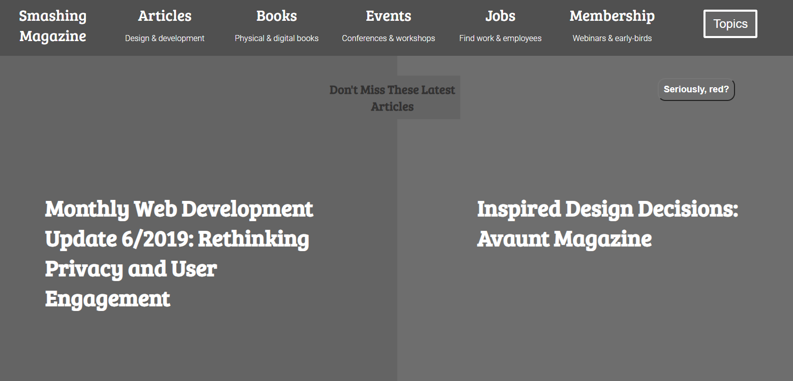

# Description
This is a design teardown of the smashing magazine homepage. The task for the project is to highlight in grayscale only the parts that a visitor would most likely see at first when looking at the page.

  

# Built With...
- HTML5
- CSS3

# Contributors
Emmanuel J. Kamala (<a href="https://github.com/emmanuelkamala">@emmanuelkamala</a>) 
Mouhamadou Diouf (<a href="https://github.com/mouhadiouf">@mouhadiouf</a>)

# Live Version

https://emmanuelkamala.github.io/smashing-magazine/

## 🤝 Contributing

Contributions, issues and feature requests are welcome!

Feel free to check the [issues page](issues/).

## Show your support

Give a ⭐️ if you like this project!

## Acknowledgments

- The odin project
- Bootstrap free framework
- Microverse tips

